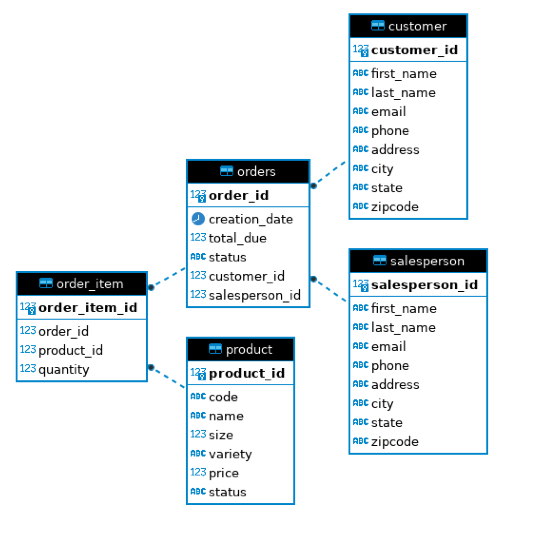

# Introduction
This app uses JDBC to connect to a postgresql database that has been provisioned using docker. On a high level, we are populating the database with sample data via the scripts in `/sql` and subsequently perform CRUD operations using the JDBC API. 

More specifically, we:
1. Mount a JDBC driver
2. Use the driver to create a connection to the database
3. Execute SQL statements through the connection
4. Commit or rollback transactions (if necessary)
5. Close the connection

Maven was used to manage our dependencies. 

# Implementation 
## ER Diagram 

## Design Patterns 
When it comes to using the JDBC API to access data in an RDBMS, two potential design patterns come to mind: the Data Access Object (DAO) pattern and the Repository pattern.

The DAO pattern, which we followed in this app, is an abstraction of data persistence and is considered closer to the database or table-centric. The DAO is implemented as an abstract class or interface that contains CRUD operations and has access to multiple tables in the database. The input and output of a DAO is a Data Transfer Object (DTO) which is a representation of the actual data in the form of a Plain Old Java Object (POJO). Thus, an instance of a DAO is quite literally an object used to access data.

On the other hand, the Repository design pattern is an abstraction of a collection of objects. In contrast to the DAO, a class in a Repository pattern only has access to a single table. A consequence of this is that table joins cannot be performed on a database level, but rather through the code itself. 

# Test 
The database was setup by reusing the scripts I made in the linux/sql project (psql_docker.sh).  Sql scripts in `/sql` were ran to populate the database with sample data. The `JDBCExecutor` class was used to perform the main JDBC workflow which includes establishing a connection and subsequently using the DAO to perform CRUD operations. The results were then logged to see if the actual output matched our expected results.
