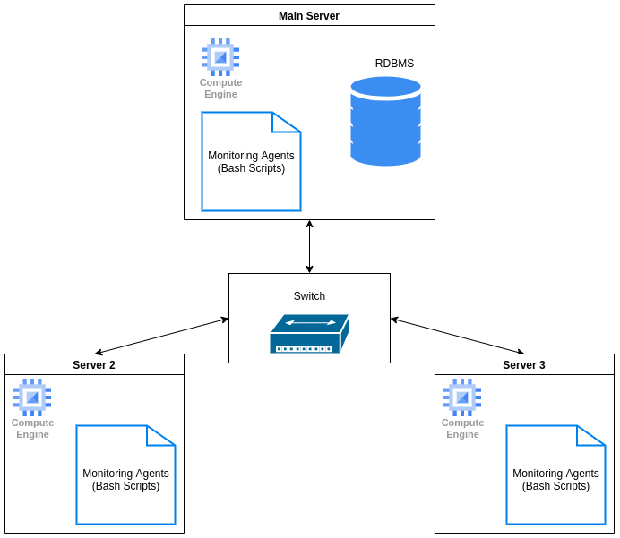

# Linux Cluster Monitoring Agent

## Introduction
This project serves as a monitoring agent for a cluster of linux nodes. For each node, we record the hardware statistics as well as monitoring the usage of the node's resources. The usage statistics are inserted into a PostgreSQL database every minute. The data can then be used to generate reports for future resource planning purposes. 

This project was implemented using bash scripts and docker.  The automation is performed by setting up a cron job which retrieves the statistics and updates the database every minute.

## Quick Start
1. Start a psql instance using docker

`./scripts/psql_docker.sh create dbuser dbpassword `

2. Create a database using psql named host_agent

`psql -h localhost -U dbuser -W`

`postgres=# CREATE DATABASE host_agent;`

`postgres=# \q;`

3. Create the host_info and host_usage tables in the newly created host_agent database using the DDL file

`psql -h localhost -U postgres -d host_agent -f sql/ddl.sql`

4. Insert hardware specs data into host_info table

`./scripts/host_info.sh "localhost" 5432 "host_agent" "dbuser" "dbpassword"`

5. Get the full path to the scripts/host_usage.sh file using `pwd`
6. Monitor hardware usage data by setting up a cron job using `cron tab -e` and insert the following:

`* * * * * bash /home/centos/dev/jrvs/bootcamp/linux_sql/host_agent/scripts/host_usage.sh localhost 5432 host_agent postgres password > /tmp/host_usage.log`

- Note: replace the path to host_usage with your output from `pwd`

## Implementation
### Architecture

### Scripts
psql_docker.sh:
- Used to create, start and stop the docker container with PostgreSQL
- `./scripts/psql_docker.sh create|start|stop [db_user] [db_password]`

host_info.sh
- Inserts hardware specs data into the database, used once per server
- `./scripts/host_info.sh "localhost" 5432 [db_name] [db_user] [db_password]`

host_usage.sh
- Inserts hardware resource usage data into the database
- `./scripts/host_usage.sh "localhost" 5432 [db_name] [db_user] [db_password]`

crontab
- Used to perform hardware resource monitoring (run host_usage.sh every minute) 
- `cron tab -e`
- `* * * * * bash /home/centos/dev/jrvs/bootcamp/linux_sql/host_agent/scripts/host_usage.sh localhost 5432 host_agent postgres password > /tmp/host_usage.log`

ddl.sql
- Creates the host_info and host_usage tables in the host_agent database if they do not currently exist
- `psql -h localhost -U postgres -d host_agent -f sql/ddl.sql`

### Database Modeling
#### host_info 
| Column | Description | Type |
| --- | ----------- | ------- |
| id | Uniquely identifies each row (PK) | serial
| hostname | Unique name of the host machine | varchar
| cpu_number | # of CPU cores in machine | int
| cpu_architecture | Low level architecture of machine | varchar
| cpu_model | Model of machine | varchar
| cpu_mhz | CPU clock speed | float
| L2_cache | Amount of L2 cache | int
| total_mem | Total amount of RAM | int 
| timestamp | Time at which data was retrieved | timestamp

#### host_usage
| Column | Description | Type |
| --- | ----------- | ------- |
| timestamp | Time at which data was retrieved (PK) | timestamp
| host_id | Foreign key (reference to id in host_info)| serial
| memory_free | Amount of RAM not in use | int
| cpu_idle | Percentage of CPU idle | int
| cpu_kernel | Percentage of CPU used to perform system tasks| int
| disk_io | Amount of disk input/output is being performed | int
| disk_available | Total amount of storage available on the disk | int 

## Test
Testing was performed by testing each bash script and sql file individually. To ensure the cron job was working as intended, I manually checked the host_usage table to see if new data was being inserted every minute.

## Deployment
This project was for meant learning purposes so has not been deployed anywhere, however the source code has been pushed to Github.

## Improvements
- Handle hardware updates
	- As it stands, our monitoring agent does not update our database if the hardware of our machine changes, it would be nice to track these changes via a new table
- More automation
	- Right now, we are manually creating a host_agent database, running multiple files, and setting up a cron jab, would be nice to encapsulate everything into a single script
